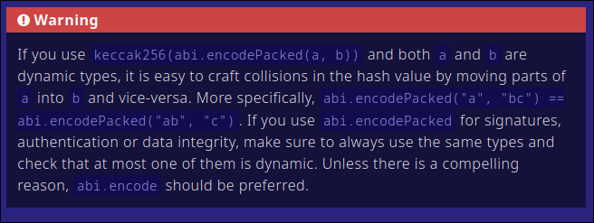

# NotADemocraticElection


---
<p align="center">
    
</p>

> 10<sup>th</sup> May 2024 \
Prepared By: perrythepwner \
Challenge Author(s): perrythepwner \
Difficulty: <font color=green>Easy</font>


# Synopsis

- The challenge consist in exploiting a common signature forgery attack, i.e. when a signature is created using `abi.encodePacked()` function. 

## Description

- In the post-apocalyptic wasteland, the remnants of human and machine factions vie for control over the last vestiges of civilization. The Automata Liberation Front (ALF) and the Cyborgs Independence Movement (CIM) are the two primary parties seeking to establish dominance. In this harsh and desolate world, democracy has taken a backseat, and power is conveyed by wealth. Will you be able to bring back some Democracy in this hopeless land?

## Skills Required

- Smart contract interaction.


## Skills Learned

- Smart contract interaction.
- Signature Forgery/Collision attack

## Analyzing the source code

Let's examine the provided source code.

**Setup.sol**
```solidity
pragma solidity 0.8.25;

import {NotADemocraticElection} from "./NotADemocraticElection.sol";

contract Setup {
    NotADemocraticElection public immutable TARGET;

    constructor() payable {
        TARGET = new NotADemocraticElection(
            bytes3("ALF"), "Automata Liberation Front",
            bytes3("CIM"), "Cyborgs Indipendence Movement"
        );
        TARGET.depositVoteCollateral{value: 100 ether}("Satoshi", "Nakamoto");
    }

    function isSolved() public view returns (bool) {
        return TARGET.winner() == bytes3("CIM");
    }
}
```

This setup will deploy the challenge instance for us. It appears that a `TARGET` contract, which is an on-chain voting contract, will be deployed with 2 parties competitors and an initial vote collateral by Satoshi Nakamoto (himself).  
Our goal is clear. We need to make the CIM party winner of the election.

**NotADemocraticElection.sol**
```solidity
pragma solidity 0.8.25;

contract NotADemocraticElection {
    // ****************************************************
    // ******* NOTE: THIS NOT A DEMOCRATIC ELECTION *******
    // ****************************************************

    uint256 constant TARGET_VOTES = 1000e18;

    struct Party {
        string  fullname;
        uint256 totalvotes;
    }
    struct Voter {
        uint256 weight;
        address addr;
    }

    mapping(bytes3 _id => Party) public parties;
    mapping(bytes _sig => Voter) public voters;
    mapping(string _name => mapping(string _surname => address _addr)) public uniqueVoters;
    bytes3 public winner;

    event Voted(
        address _voter,
        bytes3  _party
    );
    event VoterDeposited(
        address _voter,
        uint256 _weight
    );
    event ElectionWinner(
        bytes3 _party
    );

    constructor(
       bytes3 _partyAsymbol , string memory _partyAfullname,
       bytes3 _partyBsymbol , string memory _partyBfullname
    ) {
        parties[_partyAsymbol].fullname = _partyAfullname;
        parties[_partyBsymbol].fullname = _partyBfullname;
    }

    function getVotesCount(bytes3 _party) public view returns (uint256) {
        return parties[_party].totalvotes;
    }
    
    function getVoterSig(string memory _name, string memory _surname) public pure returns (bytes memory) {
        return abi.encodePacked(_name, _surname);
    }

    function checkWinner(bytes3 _party) public {
        if (parties[_party].totalvotes >= TARGET_VOTES) {
            winner = _party; 
            emit ElectionWinner(_party);
        }
    }

    function depositVoteCollateral(string memory _name, string memory _surname) external payable {
        require(uniqueVoters[_name][_surname] == address(0), "Already deposited");

        bytes memory voterSig = getVoterSig(_name, _surname);
        voters[voterSig].weight += msg.value;
        uniqueVoters[_name][_surname] = msg.sender;

        emit VoterDeposited(msg.sender, msg.value);
    }

    function vote(
        bytes3 _party,
        string memory _name,
        string memory _surname
    ) public {
        require(uniqueVoters[_name][_surname] == msg.sender, "You cannot vote on behalf of others.");

        bytes memory voterSig = getVoterSig(_name, _surname);
        uint256 voterWeight = voters[voterSig].weight == 0 ? 1 : voters[voterSig].weight;
        parties[_party].totalvotes += 1 * voterWeight;
        
        emit Voted(msg.sender, _party);
        checkWinner(_party);
    }
}
```

We will leave out from the analysis the constructor, since the contract is already deployed with the two parties registered.   

Here's a brief overview of the contract:
- The contract has a `vote` function that allows a voter to vote for a party. The voter must have previously deposited a vote collateral.
- The contract has a `depositVoteCollateral` function that allows a voter to deposit a vote collateral. The voter must not have already deposited a vote collateral.
- The contract has a `checkWinner` function that checks if a party has reached the target votes and declares it the winner.
- The contract has a `getVoterSig` function that returns the signature of a voter based on the `abi.encodePacked` function.

At first glance it looks like an easy win. There are not check on multiple votes by a single voter.  
However, this is was thought by the election organizers: restricting to only one vote per account wouldn't stop a single voter to create multiple accounts and therefore vote multiple times. Because of that, the idea on this on-chain election was to base the voting system on the deposited ETH (As hinted by the `"THIS IS NOT A DEMOCRATIC ELECTION"` warning). A voter has to deposit some collateral to vote, meaning that voting from multiple accounts become meaningless, and works also as a cheap flash loan prevention.  
It would seem that the player can still deposit 1 ETH, and vote 1000 times to reach the vote target. However since the players are provided with only a balance of 1 ETH, they will run out of gas. Lowering the vote weight by depositing 0.5 ETH and voting 2000 times would also not work, as the gas cost would still be too high. Any other combination of depositing and voting would probably fail due to gas costs, or will be too time consuming anyway.  

Shifting the focus on the `getVoterSig` function, we can see that the signature is created using the `abi.encodePacked` function. This function is known to be vulnerable to signature collisions, as the ethereum documentation [states](https://docs.soliditylang.org/en/latest/abi-spec.html).



Signature forging attack therefore becomes a viable attack vector.  

Note that we can register a voter as "Satosh iNakamoto" and for the check at line 74 the malicious user will be a completely different voter from "Satoshi Nakamoto":
```solidity
require(uniqueVoters[_name][_surname] == msg.sender, "You cannot vote on behalf of others.");`
```
However, his weight will be retrived by the signature which will collide with the voter "Satoshi Nakamoto" and consequently voting using its vote weight.  

```solidity
bytes memory voterSig = getVoterSig(_name, _surname);
uint256 voterWeight = voters[voterSig].weight == 0 ? 1 : voters[voterSig].weight;
```
By replicating the attack several times with different Name-Surname pairs such as "Satos hiNakamoto" or "Sato shiNakamoto", we could easily reach the voting target.

## Exploitation

```python
    richvoter = "SatoshiNakamoto"
    for i in range(1, 12):
        name = richvoter[:i]
        surname = richvoter[i:]
        if not name == "Satoshi" and not surname == "Nakamoto":
            print(f"[*] Attacking with voter: {name} {surname}")
            csend(target, "depositVoteCollateral(string,string)", name, surname)
            csend(target, "vote(bytes3,string,string)", "0x"+b"CIM".hex(), name, surname)
```

> HTB{h4sh_c0ll1s10n_t0_br1ng_b4ck_d3m0cr4cy}